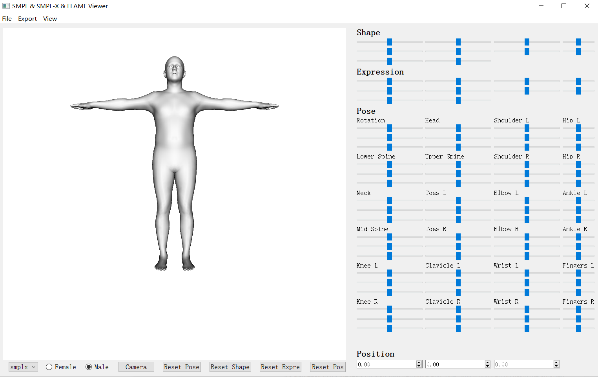

## Introduction
A visualization tool of some 3d human models(smpl/smplx/flame), also supports editing model parameters.
## Disclaimer
1. This repo is partly borrowed from [another repo](https://github.com/thmoa/smpl_viewer), adding some new features as well as new models.
2. This repo **DO NOT** provide any model file (due to their licenses), please download by yourself.
3. This repo is developed for **NON-COMERCIAL** purpose.
## Requirements & Installation
- python 3
- opendr 0.73
	- `pip install opendr==0.73`
	- if you fails, please try in this way:
		- `git clone https://github.com/Lemon-XQ/opendr`
		- `pip install glfw`
		- `python opendr/setup.py install`
- Pyqt5
	- `pip install pyqt5`
- clone this repo
	- `git clone https://github.com/Lemon-XQ/human_model_viewer`
- **download models** and **edit model path** in `human_model_viewer/ui/util.py`
	- smpl: [https://smpl.is.tue.mpg.de/]()
	- smplx: [https://smpl-x.is.tue.mpg.de/]()
	- flame: [http://flame.is.tue.mpg.de]()
## Usage
- run `python smpl_viewer.py` or directly double click `human_model_viewer.bat` (only if you are WINDOWS user)
- **GUI operations:**
	- **change model:** 'smpl' or 'smplx' or 'flame', default is 'smplx'
	- **change gender:** 'male' or 'female', default is 'male'
	- **view model:** 
		- **zoom in/out**: mouse wheel
		- **move**: mouse middle button
		- **rotate**: mouse left button
	- **edit model paras**(shape/expression/pose):
		- adjust slider values
		- **Note**: **smpl** doesn't have expression
	- save model as obj
	- save model's paras
## GUI

## License
MIT
